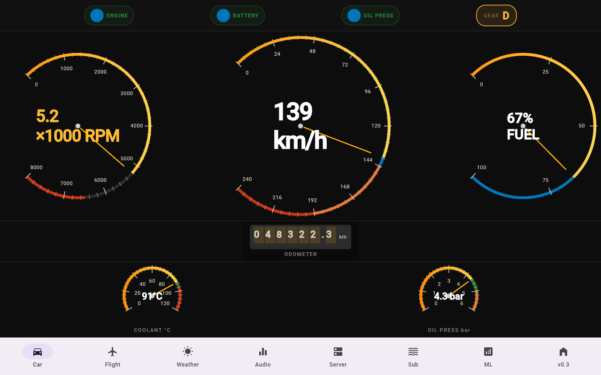
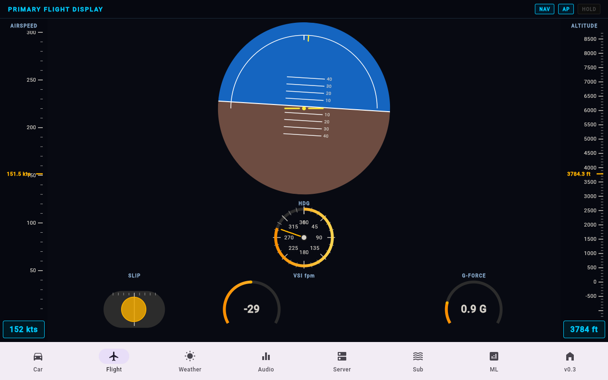
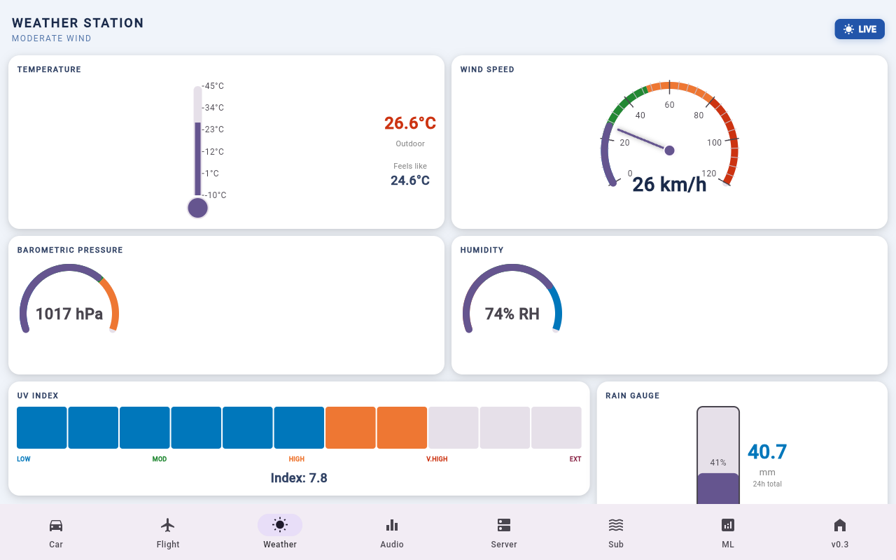
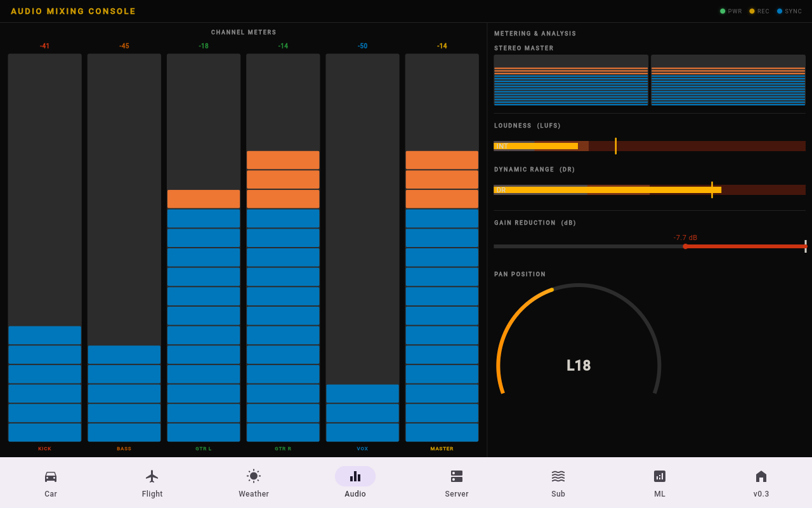
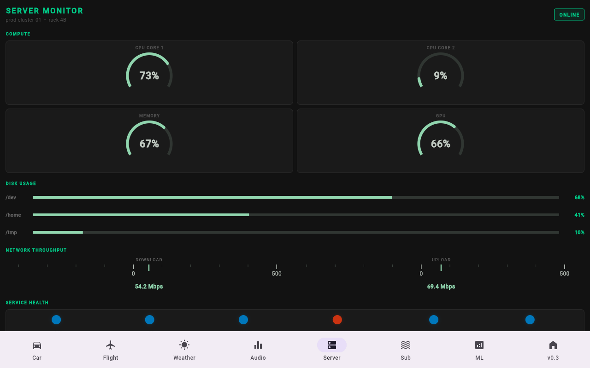
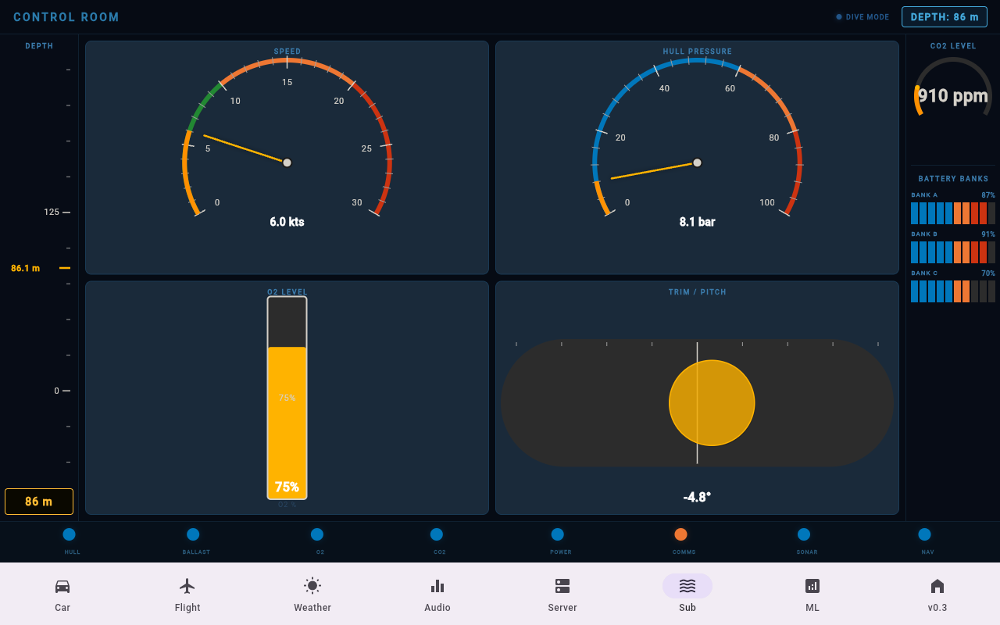
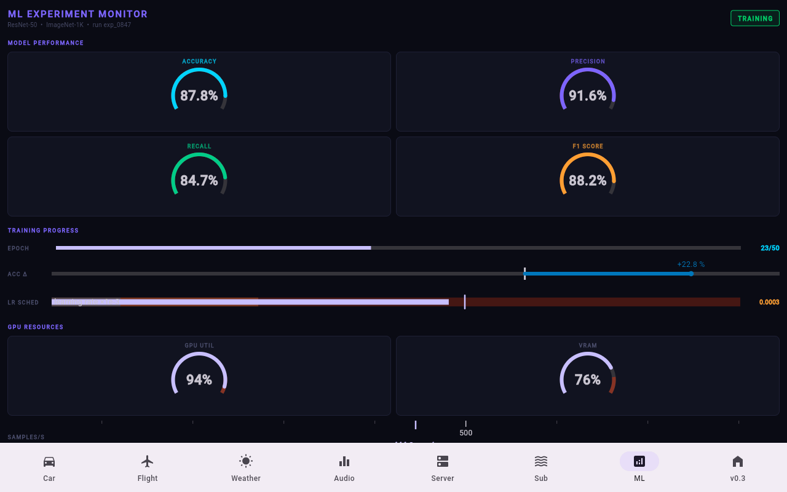
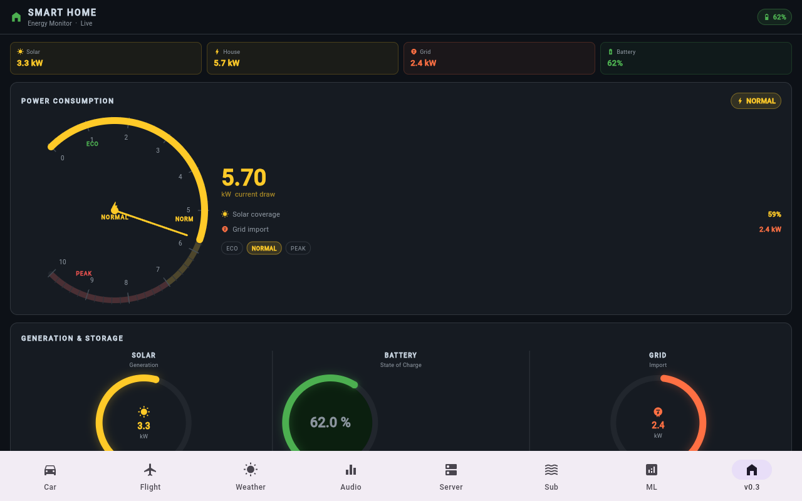

# gauge_kit

> **14 Flutter gauge widgets · zero dependencies · Material 3, Cupertino & Executive styles · MIT**

[](https://pub.dev/packages/gauge_kit)
[](LICENSE)
[](https://flutter.dev)
[](https://dart.dev)
[](https://flutter.dev/multi-platform)

A production-ready, canvas-first gauge library for Flutter. Every widget is a
`LeafRenderObjectWidget` driven by `GaugeController` — only the live pointer layer
repaints on each update, keeping frame budgets comfortable even with many gauges on
screen simultaneously.

---

## Gallery

### Car Dashboard

*RadialGauge (speedometer, tachometer, fuel), OdometerGauge, ArcGauge — Executive style*

### Flight Instruments

*ArtificialHorizonGauge, TapeGauge (airspeed, altitude), RadialGauge (heading), InclinometerGauge — Executive style*

### Weather Station

*ThermometerGauge, RadialGauge (compass), LinearGauge, ArcGauge — Executive style*

### Audio Mixer

*LevelMeterGauge, LinearGauge, SegmentedGauge — Executive style*

### Server Monitor

*ArcGauge (CPU, memory, disk), BulletGauge, StatusGauge, DeltaGauge — Executive style*

### Submarine Control

*TankGauge, InclinometerGauge, RadialGauge, TapeGauge — Executive style*

### ML / Data Science

*BulletGauge, DeltaGauge, ArcGauge, SegmentedGauge — Executive style*

### Smart Home v0.3

*ArcGauge, RadialGauge, LinearGauge with annotations, child overlays, glow effects*

---

## Why gauge_kit?

| Feature | gauge_kit | Typical alternatives |
|---------|-----------|---------------------|
| Widget count | **14** | 2–4 |
| External dependencies | **0** | 1–5 |
| License | **MIT** | Often commercial |
| Custom style API | **GaugeStyle / GaugeTokens** | Hard-coded or limited |
| Render architecture | **LeafRenderObjectWidget** | Often uses Stack/Paint |
| Accessibility | **Built-in Semantics on every widget** | Optional or absent |
| Flutter platforms | **All 6** | Usually mobile-only |

---

## Installation

```yaml
# pubspec.yaml
dependencies:
  gauge_kit: ^0.3.0
```

```dart
import 'package:gauge_kit/gauge_kit.dart';
```

---

## Quick Start

```dart
import 'package:flutter/material.dart';
import 'package:gauge_kit/gauge_kit.dart';

class MyGaugeScreen extends StatefulWidget {
  const MyGaugeScreen({super.key});

  @override
  State<MyGaugeScreen> createState() => _MyGaugeScreenState();
}

class _MyGaugeScreenState extends State<MyGaugeScreen> {
  // 1. Create a controller — it's a ChangeNotifier.
  final _ctrl = GaugeController(initialValue: 60);

  @override
  void dispose() {
    _ctrl.dispose(); // Always dispose.
    super.dispose();
  }

  @override
  Widget build(BuildContext context) {
    return Column(
      children: [
        // 2. Drop in any gauge widget.
        SizedBox(
          width: 200, height: 200,
          child: RadialGauge.speedometer(controller: _ctrl, max: 200),
        ),
        ElevatedButton(
          onPressed: () => _ctrl.animateTo(140),
          child: const Text('Accelerate'),
        ),
      ],
    );
  }
}
```

---

## GaugeController

`GaugeController` is the single source of truth for a gauge's value. It extends
`ChangeNotifier` so gauges rebuild only when the value changes.

```dart
// Create
final ctrl = GaugeController(initialValue: 0.0);

// Set value instantly (notifies listeners immediately)
ctrl.value = 75.0;

// Animate to a target value
await ctrl.animateTo(
  75.0,
  duration: const Duration(milliseconds: 600), // optional
  curve: Curves.easeInOut,                     // optional
  onAnimationEnd: () => print('done'),         // optional
);

// Stop mid-flight animation
ctrl.stopAnimation();

// Always dispose when done
ctrl.dispose();
```

### Constructor

| Parameter | Type | Default | Description |
|-----------|------|---------|-------------|
| `initialValue` | `double` | `0.0` | Starting value |

### Methods

| Method | Returns | Description |
|--------|---------|-------------|
| `value` (getter/setter) | `double` | Current gauge value |
| `animateTo(target, {duration, curve, onAnimationEnd})` | `Future<void>` | Smoothly animate to `target`; cancels any in-flight animation |
| `stopAnimation()` | `void` | Halt animation at the current position |
| `dispose()` | `void` | Release resources; call in `State.dispose()` |

---

## Widgets

### RadialGauge

A circular gauge with a sweeping needle, tick marks, labels, colored ranges, and optional
overlay widgets. Supports multiple pointers, annotations pinned at specific arc positions,
and full drag-to-set interaction.


```dart
RadialGauge(
  controller: ctrl,
  min: 0,
  max: 200,
  startAngleDeg: 225,
  sweepAngleDeg: 270,
  majorDivisions: 10,
  minorDivisions: 5,
  ranges: [
    GaugeRange(min: 0, max: 120, color: Color(0xFF0077BB)),
    GaugeRange(min: 120, max: 160, color: Color(0xFFEE7733)),
    GaugeRange(min: 160, max: 200, color: Color(0xFFCC3311)),
  ],
  showCenterLabel: true,
  unitText: 'km/h',
  interactive: true,
  onChanged: (v) => print(v),
)
```

#### Constructor Parameters

| Parameter | Type | Default | Description |
|-----------|------|---------|-------------|
| `controller` | `GaugeController` | **required** | Drives the needle position |
| `min` | `double` | `0` | Minimum scale value |
| `max` | `double` | `100` | Maximum scale value |
| `startAngleDeg` | `double` | `225` | Arc start angle in degrees (0° = 3 o'clock) |
| `sweepAngleDeg` | `double` | `270` | Arc sweep in degrees (clockwise) |
| `ranges` | `List<GaugeRange>` | `[]` | Colored bands painted on the track |
| `majorDivisions` | `int` | `5` | Number of major tick marks |
| `minorDivisions` | `int` | `5` | Minor ticks per major interval |
| `showLabels` | `bool` | `true` | Show numeric scale labels |
| `showNeedle` | `bool` | `true` | Render the main needle |
| `interactive` | `bool` | `false` | Allow drag-to-set interaction |
| `onChanged` | `ValueChanged<double>?` | `null` | Fires on drag with the new value |
| `showCenterLabel` | `bool` | `false` | Display auto-formatted value at center |
| `centerLabel` | `String?` | `null` | Override the center label text |
| `centerLabelStyle` | `TextStyle?` | `null` | Text style for the center label |
| `unitText` | `String?` | `null` | Unit suffix appended to the center value |
| `labelFormatter` | `String Function(double)?` | `null` | Custom tick label formatter |
| `child` | `Widget?` | `null` | Widget rendered at the center of the gauge face |
| `annotations` | `List<GaugeAnnotation>` | `[]` | Widgets pinned at specific arc positions |
| `extraPointers` | `List<GaugePointer>` | `[]` | Additional needles with independent controllers |
| `style` | `GaugeStyle?` | `null` | Visual style; falls back to `GaugeThemeExtension` |
| `mode` | `GaugeMode?` | `null` | `ambient` or `instrument` rendering mode |
| `semanticsLabel` | `String?` | `null` | Accessibility label for screen readers |

#### Named Constructors (Presets)

```dart
// Speedometer: 0–max km/h, danger above 80 %
RadialGauge.speedometer(controller: ctrl, max: 200)

// Tachometer: 0–maxRpm, redline above redlineRpm
RadialGauge.tachometer(controller: ctrl, redlineRpm: 6500, maxRpm: 8000)

// Fuel gauge: 0–100 %
RadialGauge.fuel(controller: ctrl)

// Compass: 0–360°
RadialGauge.compass(controller: ctrl)
```

---

### ArcGauge

A compact arc ring gauge ideal for KPI tiles, CPU/memory rings, and smart home dashboards.
Supports a `child` center overlay, `header`/`footer` widgets, glow effects, and a
`widgetIndicator` that tracks the arc tip.


```dart
ArcGauge(
  controller: ctrl,
  min: 0,
  max: 100,
  showValue: true,
  unitText: '%',
  fillColor: Colors.black,
  ranges: [
    GaugeRange(min: 80, max: 100, color: Colors.red),
  ],
  widgetIndicator: const Icon(Icons.circle, size: 12, color: Colors.white),
  header: const Text('CPU', style: TextStyle(color: Colors.white70)),
  footer: const Text('usage', style: TextStyle(fontSize: 10)),
)
```

#### Constructor Parameters

| Parameter | Type | Default | Description |
|-----------|------|---------|-------------|
| `controller` | `GaugeController` | **required** | Drives the arc fill |
| `min` | `double` | `0` | Minimum scale value |
| `max` | `double` | `100` | Maximum scale value |
| `startAngleDeg` | `double` | `135` | Arc start angle in degrees |
| `sweepAngleDeg` | `double` | `270` | Arc sweep in degrees |
| `centerLabel` | `String?` | `null` | Override the auto-formatted center label |
| `centerLabelStyle` | `TextStyle?` | `null` | Text style for the center label |
| `ranges` | `List<GaugeRange>` | `[]` | Colored bands on the track |
| `showValue` | `bool` | `true` | Render auto-formatted value at center |
| `unitText` | `String?` | `null` | Unit suffix appended to the center value |
| `child` | `Widget?` | `null` | Widget at the center of the arc (hides `showValue`) |
| `header` | `Widget?` | `null` | Widget placed above the arc |
| `footer` | `Widget?` | `null` | Widget placed below the arc |
| `fillColor` | `Color?` | `null` | Solid fill inside the arc ring |
| `reverse` | `bool` | `false` | Fill arc from the far (clockwise) end |
| `widgetIndicator` | `Widget?` | `null` | Widget that tracks the current arc tip |
| `backgroundWidth` | `double?` | `null` | Override background track stroke width |
| `style` | `GaugeStyle?` | `null` | Visual style |
| `mode` | `GaugeMode?` | `null` | `ambient` or `instrument` |
| `semanticsLabel` | `String?` | `null` | Accessibility label |

#### Named Constructors

```dart
// Network speed ring: 0–maxMbps Mbps
ArcGauge.networkSpeed(controller: ctrl, maxMbps: 1000)

// CPU usage ring: 0–100 %
ArcGauge.cpuUsage(controller: ctrl)
```

---

### LinearGauge

A horizontal or vertical bar gauge with optional ticks, labels, leading/trailing widgets,
a floating center overlay, and a `widgetIndicator` that slides with the fill.


```dart
LinearGauge(
  controller: ctrl,
  min: 0,
  max: 100,
  orientation: LinearGaugeOrientation.horizontal,
  ranges: [
    GaugeRange(min: 0, max: 30, color: Color(0xFF0077BB)),
    GaugeRange(min: 70, max: 100, color: Color(0xFFCC3311)),
  ],
  showValue: true,
  unitText: '%',
  barRadius: 8,
  widgetIndicator: const Icon(Icons.arrow_drop_up, color: Colors.white),
  leading: const Icon(Icons.volume_off),
  trailing: const Icon(Icons.volume_up),
)
```

#### Constructor Parameters

| Parameter | Type | Default | Description |
|-----------|------|---------|-------------|
| `controller` | `GaugeController` | **required** | Drives the bar fill |
| `min` | `double` | `0` | Minimum scale value |
| `max` | `double` | `100` | Maximum scale value |
| `orientation` | `LinearGaugeOrientation` | `horizontal` | `horizontal` or `vertical` |
| `ranges` | `List<GaugeRange>` | `[]` | Colored bands on the track |
| `majorDivisions` | `int` | `5` | Number of major tick marks |
| `showLabels` | `bool` | `true` | Show numeric scale labels |
| `showTicks` | `bool` | `true` | Show tick marks |
| `reverse` | `bool` | `false` | Fill bar from the far end |
| `showValue` | `bool` | `false` | Display value at the bar tip |
| `unitText` | `String?` | `null` | Unit suffix |
| `labelFormatter` | `String Function(double)?` | `null` | Custom tick label formatter |
| `barRadius` | `double?` | `null` | Corner radius for rounded-rectangle fill mode |
| `leading` | `Widget?` | `null` | Widget at the start of the bar |
| `trailing` | `Widget?` | `null` | Widget at the end of the bar |
| `center` | `Widget?` | `null` | Centered floating overlay widget |
| `widgetIndicator` | `Widget?` | `null` | Widget that tracks the bar tip |
| `style` | `GaugeStyle?` | `null` | Visual style |
| `mode` | `GaugeMode?` | `null` | `ambient` or `instrument` |
| `semanticsLabel` | `String?` | `null` | Accessibility label |

#### Named Constructors

```dart
// Horizontal progress bar (no ticks/labels)
LinearGauge.progress(controller: ctrl)

// Volume slider with danger zone
LinearGauge.volume(controller: ctrl)
```

---

### SegmentedGauge

A discrete LED-style bar gauge made of evenly-spaced segments. Great for signal
strength indicators, battery levels, and audio clip meters.


```dart
SegmentedGauge(
  controller: ctrl,
  min: 0,
  max: 100,
  segmentCount: 20,
  horizontal: true,
  gap: 2,
)
```

#### Constructor Parameters

| Parameter | Type | Default | Description |
|-----------|------|---------|-------------|
| `controller` | `GaugeController` | **required** | Drives the active segments |
| `min` | `double` | `0` | Minimum scale value |
| `max` | `double` | `100` | Maximum scale value |
| `segmentCount` | `int` | `20` | Number of discrete segments |
| `horizontal` | `bool` | `true` | Horizontal (`true`) or vertical (`false`) orientation |
| `gap` | `double` | `2` | Gap between segments in logical pixels |
| `style` | `GaugeStyle?` | `null` | Visual style |
| `mode` | `GaugeMode?` | `null` | `ambient` or `instrument` |
| `semanticsLabel` | `String?` | `null` | Accessibility label |

#### Named Constructors

```dart
// 5-bar signal strength indicator
SegmentedGauge.signalStrength(controller: ctrl)

// 10-segment battery level
SegmentedGauge.battery(controller: ctrl)
```

---

### BulletGauge

A Stephen Few-style bullet chart for KPI comparisons. Shows a performance bar
against qualitative background zones (poor / satisfactory / good) and an optional
target marker line.


```dart
BulletGauge(
  controller: ctrl,
  min: 0,
  max: 100,
  targetValue: 80,
  poorThreshold: 30,
  satisfactoryThreshold: 70,
  label: 'Revenue',
)
```

#### Constructor Parameters

| Parameter | Type | Default | Description |
|-----------|------|---------|-------------|
| `controller` | `GaugeController` | **required** | Drives the performance bar |
| `min` | `double` | `0` | Minimum value |
| `max` | `double` | `100` | Maximum value |
| `targetValue` | `double?` | `null` | Target marker position |
| `poorThreshold` | `double` | `30` | Boundary between poor and satisfactory zones |
| `satisfactoryThreshold` | `double` | `70` | Boundary between satisfactory and good zones |
| `label` | `String?` | `null` | Label for the bullet chart |
| `style` | `GaugeStyle?` | `null` | Visual style |
| `mode` | `GaugeMode?` | `null` | `ambient` or `instrument` |
| `semanticsLabel` | `String?` | `null` | Accessibility label |

#### Named Constructors

```dart
// KPI preset: target at 80 % of max
BulletGauge.kpi(controller: ctrl, max: 100, label: 'Sales')
```

---

### DeltaGauge

A change-from-baseline gauge that shows positive and negative deviations with
color-coded arrows. Includes a `lowerIsBetter` flag to invert the color semantics for
loss functions, error rates, and lap times.


```dart
DeltaGauge(
  controller: ctrl,   // value is delta, e.g. +12.5 or -3.8
  baseline: 0,
  min: -50,
  max: 50,
  unit: '%',
  lowerIsBetter: false,
)
```

#### Constructor Parameters

| Parameter | Type | Default | Description |
|-----------|------|---------|-------------|
| `controller` | `GaugeController` | **required** | Current delta value |
| `baseline` | `double` | `0` | Reference/zero point |
| `min` | `double` | `-100` | Minimum delta |
| `max` | `double` | `100` | Maximum delta |
| `unit` | `String?` | `null` | Unit suffix |
| `lowerIsBetter` | `bool` | `false` | Invert color semantics (green = negative) |
| `style` | `GaugeStyle?` | `null` | Visual style |
| `mode` | `GaugeMode?` | `null` | `ambient` or `instrument` |

---

### StatusGauge

A compact colored dot that maps a numeric level to a visual status:
`0` = normal (green), `1` = warning (amber), `2` = danger (red).

```dart
StatusGauge(
  controller: ctrl,  // set to 0, 1, or 2
  radius: 14,
  label: 'DB Health',
)
```

#### Constructor Parameters

| Parameter | Type | Default | Description |
|-----------|------|---------|-------------|
| `controller` | `GaugeController` | **required** | `0` normal · `1` warning · `2` danger |
| `radius` | `double` | `12` | Indicator dot radius |
| `label` | `String?` | `null` | Optional text label |
| `style` | `GaugeStyle?` | `null` | Visual style |
| `mode` | `GaugeMode?` | `null` | `ambient` or `instrument` |
| `semanticsLabel` | `String?` | `null` | Accessibility label |

---

### ThermometerGauge

A classic glass thermometer with a liquid column, Celsius or Fahrenheit scale, and
an optional bulb fill.

```dart
ThermometerGauge(
  controller: ctrl,  // value in Celsius
  minCelsius: -20,
  maxCelsius: 50,
  scale: TemperatureScale.celsius,
  showScale: true,
)
```

#### Constructor Parameters

| Parameter | Type | Default | Description |
|-----------|------|---------|-------------|
| `controller` | `GaugeController` | **required** | Temperature value in Celsius |
| `minCelsius` | `double` | `-20` | Minimum temperature (Celsius) |
| `maxCelsius` | `double` | `50` | Maximum temperature (Celsius) |
| `scale` | `TemperatureScale` | `celsius` | Display scale: `celsius` or `fahrenheit` |
| `showScale` | `bool` | `true` | Show scale labels |
| `style` | `GaugeStyle?` | `null` | Visual style |
| `mode` | `GaugeMode?` | `null` | `ambient` or `instrument` |
| `semanticsLabel` | `String?` | `null` | Accessibility label |

#### Named Constructors

```dart
// Industrial oven: 0–300 °C
ThermometerGauge.oven(controller: ctrl)

// Body temperature: 35–42 °C
ThermometerGauge.bodyTemp(controller: ctrl)
```

---

### TankGauge

A liquid-tank fill gauge with optional animated wave surface. Supports both vertical
and horizontal orientations.


```dart
TankGauge(
  controller: ctrl,
  min: 0,
  max: 100,
  vertical: true,
  showWave: true,
)
```

#### Constructor Parameters

| Parameter | Type | Default | Description |
|-----------|------|---------|-------------|
| `controller` | `GaugeController` | **required** | Fill level |
| `min` | `double` | `0` | Minimum level |
| `max` | `double` | `100` | Maximum level |
| `vertical` | `bool` | `true` | Vertical (`true`) or horizontal (`false`) tank |
| `showWave` | `bool` | `false` | Animate the liquid surface |
| `style` | `GaugeStyle?` | `null` | Visual style |
| `mode` | `GaugeMode?` | `null` | `ambient` or `instrument` |
| `semanticsLabel` | `String?` | `null` | Accessibility label |

#### Named Constructors

```dart
TankGauge.water(controller: ctrl)
```

---

### TapeGauge

A scrolling tape gauge in the style of aviation altimeters and airspeed indicators.
Supports both vertical and horizontal scroll directions.


```dart
TapeGauge(
  controller: ctrl,
  min: 0,
  max: 10000,
  tickInterval: 100,
  unit: 'ft',
  vertical: true,
)
```

#### Constructor Parameters

| Parameter | Type | Default | Description |
|-----------|------|---------|-------------|
| `controller` | `GaugeController` | **required** | Current value |
| `min` | `double` | `0` | Minimum tape value |
| `max` | `double` | `1000` | Maximum tape value |
| `tickInterval` | `double` | `10` | Interval between major tick marks |
| `unit` | `String?` | `null` | Unit label |
| `vertical` | `bool` | `true` | Vertical (`true`) or horizontal (`false`) tape |
| `style` | `GaugeStyle?` | `null` | Visual style |
| `mode` | `GaugeMode?` | `null` | `ambient` or `instrument` |
| `semanticsLabel` | `String?` | `null` | Accessibility label |

#### Named Constructors

```dart
TapeGauge.altimeter(controller: ctrl)   // 0–10 000 ft
TapeGauge.airspeed(controller: ctrl)    // 0–300 kts
```

---

### OdometerGauge

A rolling-digit odometer display with configurable digit and decimal counts.

```dart
OdometerGauge(
  controller: ctrl,
  digitCount: 6,
  decimalDigits: 1,
  unit: 'km',
)
```

#### Constructor Parameters

| Parameter | Type | Default | Description |
|-----------|------|---------|-------------|
| `controller` | `GaugeController` | **required** | Current value |
| `digitCount` | `int` | `6` | Number of rolling digit wheels |
| `decimalDigits` | `int` | `1` | Decimal places to show |
| `unit` | `String?` | `null` | Unit label |
| `style` | `GaugeStyle?` | `null` | Visual style |
| `mode` | `GaugeMode?` | `null` | `ambient` or `instrument` |
| `semanticsLabel` | `String?` | `null` | Accessibility label |

#### Named Constructors

```dart
OdometerGauge.mileage(controller: ctrl)  // 6 digits, 1 decimal, unit = km
```

---

### LevelMeterGauge

A multi-channel vertical VU / level meter — common in audio and broadcast applications.


```dart
LevelMeterGauge(
  controller: ctrl,
  min: 0,
  max: 100,
  channelCount: 2,
  gap: 4,
)
```

#### Constructor Parameters

| Parameter | Type | Default | Description |
|-----------|------|---------|-------------|
| `controller` | `GaugeController` | **required** | Current level |
| `min` | `double` | `0` | Minimum value |
| `max` | `double` | `100` | Maximum value |
| `channelCount` | `int` | `2` | Number of parallel meter bars |
| `gap` | `double` | `4` | Gap between channels |
| `style` | `GaugeStyle?` | `null` | Visual style |
| `mode` | `GaugeMode?` | `null` | `ambient` or `instrument` |
| `semanticsLabel` | `String?` | `null` | Accessibility label |

#### Named Constructors

```dart
LevelMeterGauge.stereo(controller: ctrl)  // 2 channels, 0–100, 4 px gap
```

---

### InclinometerGauge

A spirit-level / tilt gauge that shows angular deviation from horizontal. Used for
pitch/roll indicators and bubble levels.


```dart
InclinometerGauge(
  controller: ctrl,  // tilt in degrees
  maxAngle: 45,
)
```

#### Constructor Parameters

| Parameter | Type | Default | Description |
|-----------|------|---------|-------------|
| `controller` | `GaugeController` | **required** | Tilt angle in degrees |
| `maxAngle` | `double` | `45` | Maximum displayable tilt angle |
| `style` | `GaugeStyle?` | `null` | Visual style |
| `mode` | `GaugeMode?` | `null` | `ambient` or `instrument` |
| `semanticsLabel` | `String?` | `null` | Accessibility label |

---

### ArtificialHorizonGauge

A full AHRS attitude indicator with sky/ground fill, pitch-ladder lines, roll-arc
bezel, and a fixed aircraft symbol. Requires two controllers: one for pitch, one for roll.


```dart
ArtificialHorizonGauge(
  pitchController: pitchCtrl,  // degrees (positive = nose up)
  rollController: rollCtrl,    // degrees (positive = right bank)
)
```

#### Constructor Parameters

| Parameter | Type | Default | Description |
|-----------|------|---------|-------------|
| `pitchController` | `GaugeController` | **required** | Pitch angle in degrees |
| `rollController` | `GaugeController` | **required** | Roll (bank) angle in degrees |
| `style` | `GaugeStyle?` | `null` | Visual style (use `HorizonGaugeTokens` for sky/ground colors) |
| `mode` | `GaugeMode?` | `null` | `ambient` or `instrument` |
| `semanticsLabel` | `String?` | `null` | Accessibility label |

---

## Supporting Types

### GaugeRange

Defines a colored band on the gauge track.

```dart
GaugeRange(
  min: 60,
  max: 80,
  color: Color(0xFFEE7733),
  label: 'Warning zone',  // optional, used for semantics
)
```

| Parameter | Type | Required | Description |
|-----------|------|----------|-------------|
| `min` | `double` | yes | Lower bound |
| `max` | `double` | yes | Upper bound (must be > min) |
| `color` | `Color` | yes | Band fill color |
| `label` | `String?` | no | Semantic label |

---

### GaugeAnnotation

Pins any Flutter widget at a specific value position on the `RadialGauge` arc.

```dart
GaugeAnnotation(
  value: 100,
  radiusFraction: 0.55,   // 0.0 = center, 1.0 = track arc
  offset: Offset(0, -4),  // optional pixel nudge
  widget: Container(
    padding: const EdgeInsets.all(4),
    decoration: BoxDecoration(color: Colors.red, shape: BoxShape.circle),
    child: const Text('!', style: TextStyle(color: Colors.white)),
  ),
)
```

| Parameter | Type | Default | Description |
|-----------|------|---------|-------------|
| `value` | `double` | **required** | Scale position where the widget anchors |
| `widget` | `Widget` | **required** | Widget to render at that position |
| `radiusFraction` | `double` | `0.65` | Radial distance — `0.0` = center, `1.0` = track arc |
| `offset` | `Offset` | `Offset.zero` | Pixel nudge after angular resolution |

---

### GaugePointer

An extra needle bound to its own `GaugeController`, rendered on top of the main
needle in `RadialGauge`.

```dart
RadialGauge(
  controller: speedCtrl,
  min: 0,
  max: 200,
  extraPointers: [
    GaugePointer(
      controller: limitCtrl,
      color: Colors.red,
      strokeWidth: 2,
      lengthFraction: 0.7,
      label: 'Speed limit',
    ),
  ],
)
```

| Parameter | Type | Default | Description |
|-----------|------|---------|-------------|
| `controller` | `GaugeController` | **required** | Drives this pointer's position |
| `color` | `Color?` | `null` | Needle color (defaults to token needle color @ 70 % opacity) |
| `strokeWidth` | `double?` | `null` | Needle width (defaults to token needle width) |
| `lengthFraction` | `double` | `0.75` | Fraction of gauge radius this needle reaches |
| `label` | `String?` | `null` | Semantic label |

---

## Styling

gauge_kit has a three-level style system:

### 1. Global style via `GaugeThemeExtension`

Set once in `MaterialApp.theme` — all gauges in the subtree pick it up automatically.

```dart
MaterialApp(
  theme: ThemeData(
    extensions: const [
      GaugeThemeExtension(
        style: ExecutiveGaugeStyle(),
        defaultMode: GaugeMode.instrument,
      ),
    ],
  ),
)
```

### 2. Per-widget style override

```dart
RadialGauge(
  controller: ctrl,
  style: const CupertinoGaugeStyle(),
  mode: GaugeMode.ambient,
)
```

### 3. Token-level fine-tuning via `GaugeTokensOverride`

```dart
RadialGauge(
  controller: ctrl,
  style: const ExecutiveGaugeStyle().override(
    GaugeTokensOverride(
      valueColor: const Color(0xFFE91E63),
      valueGlowRadius: 8,
      needleDropShadow: true,
    ),
  ),
)
```

### 4. Fully custom brand style

```dart
class BrandStyle extends GaugeStyle {
  const BrandStyle();

  @override
  GaugeTokens resolve(BuildContext context, GaugeMode mode) => GaugeTokens(
    valueColor: const Color(0xFF00BCD4),
    trackColor: const Color(0xFF1A2A3A),
    needleColor: const Color(0xFFFFFFFF),
    knobColor: const Color(0xFF00BCD4),
    valueGlowRadius: 6,
  );
}
```

---

### Built-in Styles

| Style | Description |
|-------|-------------|
| `MaterialGaugeStyle` | Reads colors from the ambient Material 3 `ColorScheme` |
| `CupertinoGaugeStyle` | iOS-inspired muted tones, thin strokes |
| `ExecutiveGaugeStyle` | Dark panel, amber needle, chrome ticks — used in all example dashboards |
| `DefaultGaugeStyle` | Neutral fallback when no theme extension is configured |

---

### GaugeTokens Reference

`GaugeTokens` is the resolved set of visual primitives used by every render engine.
Pass it via `GaugeStyle.resolve()` or use `GaugeTokensOverride` for partial overrides.

| Token | Type | Default | Description |
|-------|------|---------|-------------|
| `trackColor` | `Color` | `0xFF3D3D3D` | Background track color |
| `trackStrokeWidth` | `double` | `8.0` | Track stroke width in px |
| `trackStrokeCap` | `StrokeCap` | `round` | Track end cap style |
| `trackBorderRadius` | `double` | `4.0` | Corner radius (linear gauges) |
| `valueColor` | `Color` | `0xFF6750A4` | Value arc / bar fill color |
| `valueStrokeWidth` | `double` | `10.0` | Value arc / bar stroke width |
| `valueGradient` | `Gradient?` | `null` | Gradient overriding `valueColor` |
| `valueGlowRadius` | `double` | `0.0` | Outer glow blur radius (0 = disabled) |
| `valueGlowColor` | `Color?` | `null` | Glow color (defaults to `valueColor` @ 50 %) |
| `needleColor` | `Color` | `0xFF6750A4` | Needle body color |
| `needleWidth` | `double` | `3.0` | Needle stroke width at widest point |
| `needleTipStyle` | `NeedleTipStyle` | `sharp` | `sharp` · `flat` · `circle` |
| `needleDropShadow` | `bool` | `false` | Drop shadow under needle |
| `knobColor` | `Color` | `0xFF6750A4` | Center knob fill |
| `knobRadius` | `double` | `8.0` | Center knob radius |
| `knobBorderColor` | `Color?` | `null` | Optional ring around knob |
| `knobBorderWidth` | `double` | `2.0` | Knob border stroke width |
| `majorTick` | `GaugeTickStyle` | grey 1.5 px 12 px | Major tick appearance |
| `minorTick` | `GaugeTickStyle` | light grey 1 px 6 px | Minor tick appearance |
| `labelStyle` | `TextStyle` | grey 10 sp | Scale label text style |
| `labelOffset` | `double` | `16.0` | Gap between tick edge and label |
| `zoneNormal` | `Color` | `0xFF0077BB` | Normal zone color |
| `zoneWarning` | `Color` | `0xFFEE7733` | Warning zone color |
| `zoneDanger` | `Color` | `0xFFCC3311` | Danger zone color |
| `dragOverlayColor` | `Color` | `0x336750A4` | Interactive drag overlay tint |
| `dragOverlayRadius` | `double` | `20.0` | Drag overlay circle radius |
| `animationDuration` | `Duration` | `600 ms` | Implicit animation duration |
| `animationCurve` | `Curve` | `easeInOut` | Implicit animation easing |

---

### GaugeMode

| Mode | Description |
|------|-------------|
| `GaugeMode.ambient` | Spacious, rounded caps, 600 ms ease animation — for dashboards and kiosk screens |
| `GaugeMode.instrument` | Compact, butt caps, tabular figures, 300 ms easeOut — for cockpits and industrial panels |

---

## Animation

```dart
// Animate to a value (no AnimationController needed)
await ctrl.animateTo(85.0);

// Custom timing
await ctrl.animateTo(
  85.0,
  duration: const Duration(milliseconds: 300),
  curve: Curves.bounceOut,
);

// Callback on completion
ctrl.animateTo(100, onAnimationEnd: () => showDialog(...));

// Halt mid-flight
ctrl.stopAnimation();

// Instant set (triggers implicit widget animation if tokens have a duration)
ctrl.value = 50;
```

---

## Accessibility

Every gauge wraps its canvas in a `Semantics` node and announces the current value
to screen readers on every update. Override the announcement string with
`semanticsLabel`:

```dart
RadialGauge(
  controller: ctrl,
  semanticsLabel: 'Engine RPM — ${ctrl.value.toInt()} RPM',
)
```

---

## Performance

- **Repaint boundary** — each gauge is `isRepaintBoundary = true`; parent repaints
  never cascade into gauge canvases.
- **Picture cache** — the static layer (track, ranges, ticks, labels) is painted once
  into a `ui.Picture` and replayed on subsequent frames; only the pointer/value layer
  repaints on controller updates.
- **No `setState`** — controllers notify via `ChangeNotifier`; the render box
  subscribes directly, bypassing the widget rebuild cycle entirely.
- **Zero layout passes** — `LeafRenderObjectWidget` has no children, so layout is
  O(1) per gauge.

---

## Advanced: Direct Render Box Access

For custom container widgets that need to measure or paint alongside gauge canvases,
import the rendering barrel:

```dart
import 'package:gauge_kit/gauge_kit_rendering.dart';

// Access render box types such as:
// RadialGaugeRenderBox, ArcGaugeRenderBox, LinearGaugeRenderBox, ...
```

---

## Example Dashboards

The `example/` folder ships eight live dashboards that demonstrate the full API:

| Tab | Screen | Key Widgets |
|-----|--------|-------------|
| Car | `CarDashboardScreen` | `RadialGauge.speedometer`, `RadialGauge.tachometer`, `OdometerGauge`, `ArcGauge` |
| Flight | `FlightDashboardScreen` | `ArtificialHorizonGauge`, `TapeGauge.altimeter`, `TapeGauge.airspeed`, `RadialGauge.compass` |
| Weather | `WeatherDashboardScreen` | `ThermometerGauge`, `RadialGauge.compass`, `LinearGauge`, `ArcGauge` |
| Audio | `AudioDashboardScreen` | `LevelMeterGauge.stereo`, `LinearGauge.volume`, `SegmentedGauge` |
| Server | `ServerDashboardScreen` | `ArcGauge.cpuUsage`, `BulletGauge.kpi`, `StatusGauge`, `DeltaGauge` |
| Sub | `SubmarineDashboardScreen` | `TankGauge`, `InclinometerGauge`, `TapeGauge`, `RadialGauge` |
| ML | `DataScienceDashboardScreen` | `BulletGauge`, `DeltaGauge`, `ArcGauge`, `SegmentedGauge` |
| v0.3 | `SmartHomeScreen` | `ArcGauge` with `child`/`widgetIndicator`, `RadialGauge` with `annotations`, `LinearGauge` |

Run the example:

```bash
cd example
flutter run
```

---

## Contributing

Contributions are welcome! Please read [CONTRIBUTING.md](.github/CONTRIBUTING.md) before
opening a pull request.

- Bug reports → [GitHub Issues](https://github.com/sayed3li97/flutter_gauge/issues)
- Feature requests → [GitHub Issues](https://github.com/sayed3li97/flutter_gauge/issues)
- Pull requests → [GitHub PRs](https://github.com/sayed3li97/flutter_gauge/pulls)

---

## License

MIT — see [LICENSE](LICENSE).

---

*Built with ❤️ using pure Flutter Canvas — no external dependencies.*
